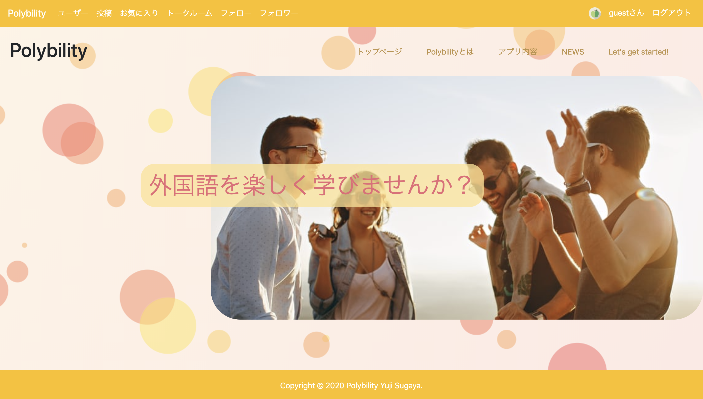
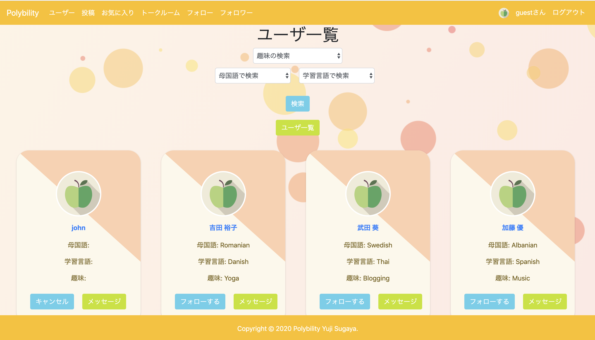
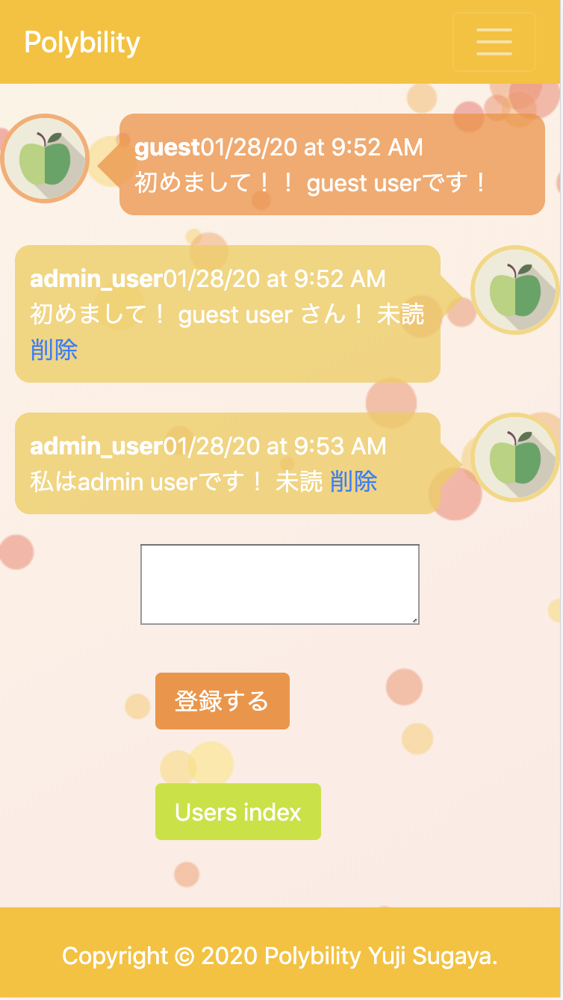
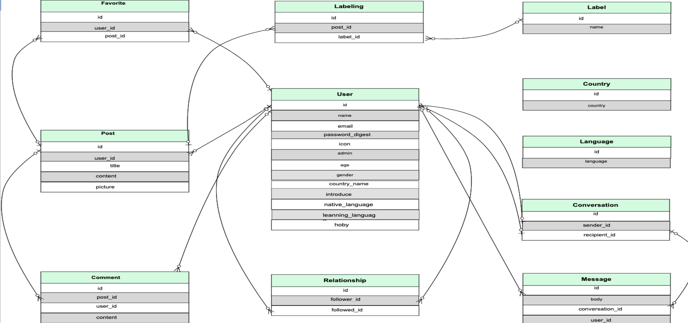
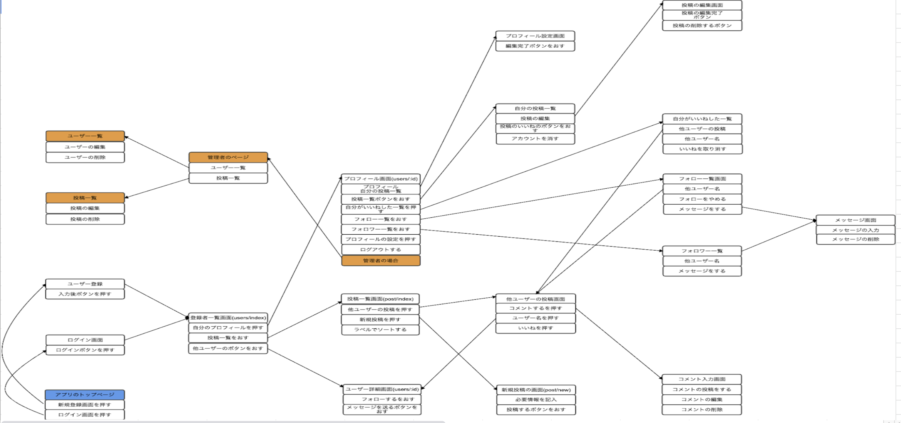
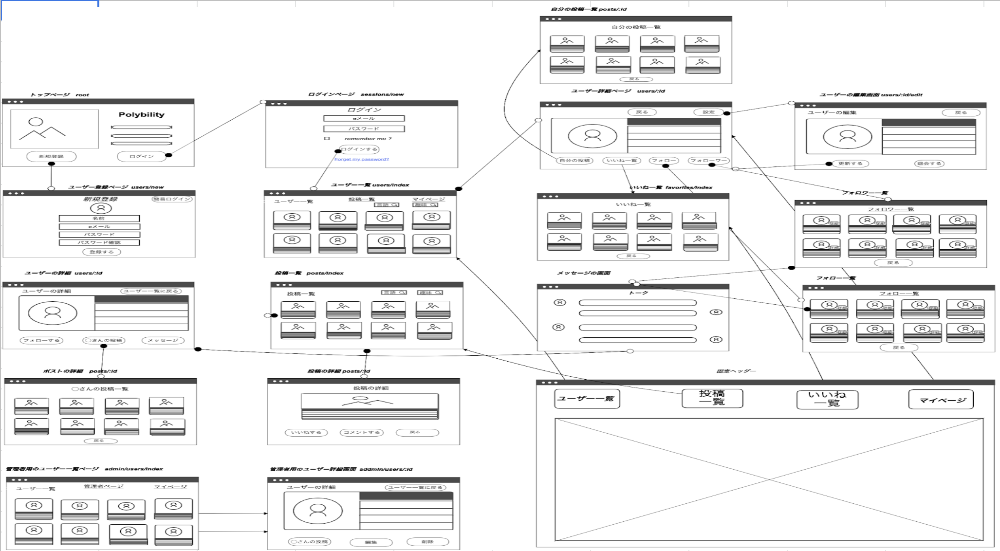

# README

# Polybility
## (スマホにも対応しています、タブレットサイズは製作中のため未対応)
## https://dry-eyrie-92117.herokuapp.com/ (heroku)
## http://52.193.252.2/ (EC2) ドメイン未取得のためfacebook認証使用できません

+ アプリのQRコードです。

# 概要
* 外国語を勉強している日本人と日本語を勉強している外国人を
* 共通の趣味などで繋げ、国際交流や語学学習を促進させるための言語交換アプリ

# バージョン情報
* Ruby 2.6.3
* Rails 5.2.4.1

# 機能一覧
- [ ] ユーザー登録機能
- [ ] ログイン機能
- [ ] Facebookを用いたソーシャルログイン機能
- [ ] 画像、文章の投稿機能
- [ ] お気に入り機能
- [ ] フォロー機能
- [ ] ダイレクトメッセージ機能
- [ ] 検索、絞り込み機能
- [ ] ページネーション機能
- [ ] 言語切り替え機能

# カタログ設計
https://docs.google.com/spreadsheets/d/1HGmx7fWY8SfSPO0O3gJnoXRUiJE9wdVVGKEANiKlw8s/edit#gid=0
# テーブル設計
https://docs.google.com/spreadsheets/d/1HGmx7fWY8SfSPO0O3gJnoXRUiJE9wdVVGKEANiKlw8s/edit#gid=1191385107
# ER図
https://docs.google.com/spreadsheets/d/1HGmx7fWY8SfSPO0O3gJnoXRUiJE9wdVVGKEANiKlw8s/edit#gid=1367702877

# 画面遷移図
https://docs.google.com/spreadsheets/d/1HGmx7fWY8SfSPO0O3gJnoXRUiJE9wdVVGKEANiKlw8s/edit#gid=1790406822

# ワイヤーフレーム
https://docs.google.com/spreadsheets/d/1HGmx7fWY8SfSPO0O3gJnoXRUiJE9wdVVGKEANiKlw8s/edit#gid=2030893948

# 使用gem一覧

## 辞書機能
* rails-i18n

## ログイン機能
* devise
* omniauth
* omniauth-facebook

## アドミン機能
* rails_admin
* cancancan

## 画像機能
* carrierwave
* mini_magick
* fog-aws

## ページネーション機能
* kaminari
* kaminari-bootstrap

## 検索機能
* ransack

## AWS
* dotenv-rails
* unicorn
* mini_racer
* capistrano
* capistrano-bundler
* capistrano-rails
* capistrano-rbenv
* capistrano3-unicorn

## デバッグ
* pry-rails
* better_errors

## テスト
* rspec-rails
* spring-commands-rspec
* factory_bot_rails
* faker
* launchy
* capybara
* webdrivers

# Set up
* 1 git clone git@github.com:yujiharinezumi/Polybility.git
* 2 bundle install
* 3 rails db:create db:migrate
* 4 rails db:seed
* 5 rails s
